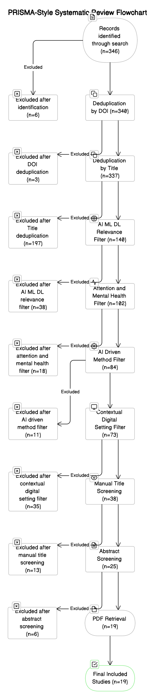

# Title:
A Systematic Review on AI-Powered Methods for Assessing Attention and Focus in the Digital Age

# Abstract:
In today's world, our attention and focus are constantly broken due to regular interaction with technology. In our daily life, we spend quite some time with our smartphones, computers, and other devices. Due to the increase in screen time, our thought process has suffered greatly. With that in mind, it was obvious to realize the need for intelligent systems capable of monitoring, assessing, and increasing attention and focus. Artificial Intelligence or AI, particularly machine learning and deep learning models, has shown great promise in automating the detection and evaluation of mental health issues such as attention and focus. This systematic literature review examines the current state of AI-powered methods for assessing attention and focus in digital environments. We followed PRISMA guidelines to identify and filter relevant literature across five major databases, ultimately narrowing it down to 19 highly matched papers. Our systematic literature review focuses on the AI-powered techniques, common datasets used, the evaluation metrics used, and applications such as online learning, mobile usage, and social media, and their role in assessing attention and focus. From our work, the key findings reveal that most of the AI-powered methodologies have a great reliance on supervised learning algorithms and techniques. The paper concludes by outlining current challenges and recommending directions for future research.

# 1. Introduction:
Attention and focus are the two greatest components of human psychology. They play a critical role in learning, productivity, and mental health. However, the frequent use of  technology such as smartphones and social media platforms in the online education system has introduced new challenges for mental health issues, especially with learning, keeping up attention, and focus while doing so.

Recent advancements in machine learning, deep learning, and other AI techniques, along with cognitive science, offer a variety of techniques for modeling human attention through behavioral, physiological, and interaction-based signals. 

Currently, these systems are being deployed in educational environments, digital well-being tools, human-computer interaction systems, and mental health diagnostics. But, despite the growing interest in research in this domain, there is a limited combination of findings regarding the specific AI methods used, their effectiveness, and the contexts in which they are applied. And that is the main focus of our research.

This systematic literature review aims to critically analyze the studies that use AI-powered approaches for assessing attention and focus in digital contexts.

# 2. Methodology:
Our review process follows the systematic methodology described in the PRISMA framework. The process involved designing a search term, multiple database queries, filtering papers, and then manual screening, as mentioned below. We used a very intelligent search technique,  the detailed search strategy table provided below. This was specifically designed to cover a wide range of relevant domains.

**2.1 Search Strategy and Data Sources**
We used a comprehensive search strategy. We formulated this strategy using a combination of terms related to AI techniques and attention, and focus. The search was conducted across five major academic databases: IEEE Xplore, ACM Digital Library, ScienceDirect, Google Scholar, and PubMed. Our research resulted in an initial pool of 346 papers. These areas included AI/ML core terms, human-computer interaction, or HCI. We also considered non-AI tools, digital distraction, education, and mental health.

**Search Log Table**

| Main Area                                            | Search Terms                                                                                                                                                                                                                                                                                                                                                               | Example Paper Count (adjust as you collect) |
| ---------------------------------------------------- | -------------------------------------------------------------------------------------------------------------------------------------------------------------------------------------------------------------------------------------------------------------------------------------------------------------------------------------------------------------------------- | ------------------------------------------- |
| **AI/ML-focused (Generic)**                          | "AI-based attention assessment", "Artificial Intelligence for attention and focus", "Machine learning attention tracking", "Deep learning for cognitive focus", "AI models for focus detection", "Intelligent systems for attention measurement", "Neural networks for attention analysis", "Transformer models for attention estimation", "AI-based attention prediction" | 70                                          |
| **AI/ML + Human Factors**                            | "AI in cognitive psychology", "Machine learning for cognitive load estimation", "AI-based focus analysis in human-computer interaction", "AI and attention span detection", "AI-based focus assessment in education", "ML models for attention monitoring in digital learning"                                                                                             | 32                                          |
| **Computer Science + Non-AI Technical Methods**      | "Software tools for attention tracking", "Digital methods for cognitive load measurement", "Sensor-based focus detection", "Non-AI attention analysis", "Computer vision attention measurement (non-AI)", "EEG-based attention analysis (non-ML)", "Web-based cognitive focus tools", "Technology-supported attention evaluation"                                          | 28                                          |
| **AI + Technology Usage (Social Media, Apps, etc.)** | "AI for attention span analysis on social media", "AI attention detection in app usage", "AI-based digital well-being models", "Machine learning for smartphone distraction detection", "AI tracking of multitasking impact", "AI-based behavioral data for attention", "AI + attention analysis + mobile data"                                                            | 24                                          |
| **Tech Usage Only (No AI)**                          | "Impact of smartphone use on attention", "Attention problems in digital age", "Technology and attention span issues", "Screen time and focus disruption", "Cognitive load due to digital technology", "Focus-related digital distraction", "Attention span in tech-driven environment"                                                                                     | 63                                          |
| **Education / Learning Environments + AI**           | "AI-powered focus tracking in online learning", "AI-based attention monitoring in e-learning", "Intelligent tutoring systems and focus", "ML-based student engagement prediction", "AI for assessing attention in MOOCs"                                                                                                                                                   | 66                                          |
| **Healthcare / Mental Health + AI**                  | "AI detection of ADHD", "Machine learning for attention disorders", "AI models for neurodivergent focus patterns", "AI-powered assessment of attention deficits", "AI + cognitive load in mental health"                                                                                                                                                                   | 63                                          |

**2.2 PRISMA Steps**

**Identification**
In the identification phase, we gathered from seven CSV files, each CSV file contained results from literature searches conducted over the five academic databases: IEEE Xplore, ACM Digital Library, ScienceDirect, Google Scholar, and PubMed. We performed the searches using keyword combinations related to "Artificial Intelligence", "Machine Learning", and "Attention/Focus". This stage resulted in 346 initial records.

**Deduplication (DOI Link)**
To eliminate duplicate studies, an automated Python program was used to compare the "DOI link" field across all records. As each DOI uniquely identifies a publication, this method reliably removes redundant entries. This step excluded 6 duplicate records, reducing the dataset to 340 unique papers.

**Deduplication (Paper Title)**
Some duplicate papers did not share an identical DOI link due to formatting issues or missing values. To address this, we used the same Python program[20] to normalize the "Paper Title" field (by converting to lowercase, stripping whitespace, and standardizing spacing). In this step, we removed an additional 3 records and resulting in a final dataset of 337 unique papers.

**AI, ML, DL Relevance Filter**
In this stage, we wrote another Python program[21] to keep only the papers whose titles mentioned AI-related terms. 
* Firstly, we converted all characters to lowercase.
* Then we replaced all the hyphens (-) and slashes (/) with spaces too, so that compound terms like "AI-based" and "AI/ML" become "AI-based" and "ai ml".

The script then matched cleaned titles against a list of AI-related keywords using regex. Only titles containing terms like "ai", "artificial intelligence", "ml", "machine learning", "dl", or "deep learning" were retained. After this filtering step, the dataset was reduced from 337 to 140 papers.

**Attention & Mental Health Filter**
In this stage, we wrote another Python program[22] to keep only those papers whose titles aligned with the core of our research objective: AI-powered methods for assessing attention and mental focus. To ensure perfect matching, the program used a curated list of over 50 keywords related to **attention**, **cognitive function**, and **mental health** conditions such as "attention span", "cognitive load", "ADHD", and "working memory". In this step, the paper dataset was reduced to 102 papers.

**AI-Driven Method Filter**
In this stage, we again used a Python script[23]  to further refine the dataset by **including only those papers** whose titles mentioned AI-driven methodological terms. To achieve this, the script uses a list of AI method keywords, including terms such as "detection", "assessment", "modeling", "learning", "prediction", and "classification". Regex with word boundary matching ensured accurate filtering without capturing partial words. As a result, 84 papers were included in the final dataset.

**Contextual/Digital Setting Filter**
In this step, we used another Python script[24] to keep only those papers whose titles mentioned a digital environment relevant to AI-powered attention research. The script matched the cleaned titles against a list of keywords representing digital platforms, educational settings, such as "digital", "learning", "social media", "application", "user behavior", and "human factors". The process reduced the dataset from 84 to **73 papers**.

**Manual Title Screening**
In this stage, we manually checked the 73 papers that passed all previous automated program filters. We carefully examined the title of each paper to determine whether it directly aligned with our research. **AI-powered methods for assessing attention and focus in digital environments**. Papers that were off-topic, too general, focused on unrelated AI applications, or lacked a clear connection to attention/focus were excluded based on expert judgement. As a result, the dataset was reduced to a final set of **38 papers**.

**Abstract Screening**
In this stage, we manually reviewed the abstracts of the remaining 38 papers to determine their **high relevance** to the research topic. 

We used the following five points to make the judgment:
* **AI/ML techniques** applied to **attention or focus assessment**
* Use of relevant **datasets and metrics**
* Evidence of **model effectiveness**
* Discussion of **technical challenges**
* Suggestions for **future directions**

Papers that clearly addressed these points in digital environments, such as online learning, smart classrooms, and real-time monitoring systems, were kept. The process resulted in **25 papers**. These are the papers that are mostly aligned with our research.

**PDF Retrieval**  
Out of the 25 papers that we selected after abstract screening, we found full-text PDFs for 19 papers. These are the final 19 papers.

**PRISMA Log Table**

| Stage                             | Criteria                                                                                                             | Included / Excluded | Paper Remaining Count |
| --------------------------------- | -------------------------------------------------------------------------------------------------------------------- | ------------------- | --------------------- |
| Identification                    | Records identified using search terms across 7 CSV files from 5 databases                                            | Included            | 346                   |
| Deduplication (DOI link)          | Removed exact duplicates based on 'DOI link' field using Python script                                               | Excluded            | 340                   |
| Deduplication (Title)             | Removed additional duplicates using normalized 'Paper Title' with Python-based string cleaning and matching          | Excluded            | 337                   |
| AI, ML, DL Relevance Filter       | Filtered titles using Python to retain only papers mentioning AI, ML, or DL (handling hyphens, slashes, punctuation) | Excluded            | 140                   |
| Attention & Mental Health Filter  | Filtered papers using Python to include only those mentioning attention, focus, cognitive load, or mental health     | Excluded            | 102                   |
| AI-Driven Method Filter           | Included only papers with AI-method terms (e.g., detection, prediction, modeling) in title using Python              | Included            | 84                    |
| Contextual/Digital Setting Filter | Included only papers with digital or behavioral context terms (e.g., learning, app, social media, human factors)     | Included            | 73                    |
| Manual Title Screening            | Manually excluded irrelevant papers based on subjective review of titles and topic fit                               | Excluded            | 38                    |
| Abstract Screening                | Retained only highly relevant papers after manual review of abstracts against SLR criteria and RQs                   | Included            | 25                    |
| PDF Retrieval                     | Successfully retrieved full-text PDF versions of selected papers for in-depth review                                 | Included            | 19                    |

# 3. Data Extraction

This table summarizes key extracted information from 19 reviewed research papers related to AI based attention monitoring, focus, and engagement detection.

| No. | Paper Title | AI Techniques Used | Dataset Description | Evaluation Metrics | Reported Accuracy / Effectiveness | Key Challenges Noted | Future Directions Suggested |
|-----|-------------|--------------------|----------------------|---------------------|------------------------------------|------------------------|------------------------------|
| 1 | Student’s Attention Monitoring System in Learning Environments based on Artificial Intelligence [1] | YOLO v3, Deep Learning, Computer Vision | Facial expressions, head pose, motion data from video conferences | Accuracy, Attention %, Facial Expression Detection | High real-time monitoring accuracy | Real-time performance, virtual learning limitations, facial expression analysis | Multi-modal learning, real-time behavior analysis, virtual engagement |
| 2 | Predicting Level of Visual Focus of Human’s Attention Using ML Approaches [2] | Logistic Regression, SVM, Decision Tree, KNN, AdaBoost, MLP, Extra Tree, Voting Classifier | Survey reports + eyeball tracking | Accuracy | LR: 96%, Voting: 95% | Small sample, self-report bias, simple hardware | Larger diverse samples, personalization, real-time data |
| 3 | Classification of EEG Signals for Cognitive Load Estimation Using DL Architectures [3] | SDAE+MLP, LSTM+MLP, SVM, KNN, LDA | EEG data (64-channel) at IIT Kharagpur | Accuracy | LSTM+MLP: 85.42% | Small dataset, subject variability, denoising | Larger datasets, personalization, hybrid models |
| 4 | Cognitive Load Estimation Using Hybrid Cluster-Based Unsupervised ML Technique [4] | Hybrid clustering, 1D CNN | 4-channel wearable EEG (Baseline & Stroop test) | Accuracy, Homogeneity, ARI, SC | Accuracy: 93.2%, ARI: 0.78 | Generalization, real-world application | Real-time estimation, low manual effort |
| 5 | Early Detection of Preschool Children with ADHD Using AI & Mobile Apps [5] | Mobile apps, AI tools, video analytics | Psychometric scales, behavioral data, app usage | DSM-5/ICD-10, clinical validation | Mobile apps effective for early detection | Subjectivity, comorbidity, over/under-diagnosis | Larger validation, explainable AI, early intervention |
| 6 | TeacherEye: AI-Powered Monitoring System for Online Education [6] | DeepFace, VGG-Face, Dlib, MediaPipe, GPT-4 | Webcam video/audio, face images, speech clips | Recall, WER, Precision | Face ID: 100%, Audio: 92.6%, Cheating: 80% | Privacy, false positives, sensory limits | On-device processing, GUI integration |
| 7 | Students’ Attention Assessment in eLearning with ML [7] | Gabor, SVM, NBC, KNN, PCA, facial landmarks | CEW dataset (eye state), 32x32 pixel images | Classification Accuracy | Gabor+SVM: 93.1% | Binary classification only, frontal face required | Blink detection, diverse attention features |
| 8 | Real-Time Attention Monitoring with DL [8] | YOLOv5, DeepSORT | 5,701 action images + 35,000 emotion images | Precision, Recall, mAP@0.5, F1 | Action: 76% mAP, Emotion: 87.7% mAP | Small dataset, privacy | Multi-modal fusion, explainable AI |
| 9 | Student-Engagement Detection in Classroom Using ML [9] | CATBoost, XGBoost, LightGBM | OULAD dataset (32,593 records) | Accuracy, F1, AUC-ROC | CATBoost: 92.23%, AUC: 0.9626 | Class imbalance | Adaptive interventions |
|10 | Dyslexia Adaptive Learning Model: Engagement Prediction [10] | SVM, BoF, k-Means | 600 face images (30 students) | Accuracy | SVM Linear: 97.8% | Small sample, occlusion | Integrate video |
|11 | ML in ADHD and Depression Mental Health Diagnosis: A Survey [11] | SVM, CNN, Random Forest | ADHD-200 (973), DAIC-WOZ (142) | Accuracy, AUC | ADHD: 99.58%, Depression: 100% (EEG) | Data imbalance | Multimodal datasets |
|12 | ML in ADHD: Neural Mechanism Analysis [12] | SVM, DNN, LASSO | ADHD-200, ABCD | AUC, Sensitivity | 60-90% Accuracy | Small samples | Generative models |
|13 | Automatic Diagnosis of ADHD Using ML [13] | Decision Tree, Random Forest, SVM | NHS data (69 patients) | AUC | DT: 85.5%, AUC: 0.871 | Overfitting | Fuzzy rule-based models |
|14 | Game Data Analysis for ADHD Assessment [14] | AdaBoost, JRip | Sifteo Cubes, 52 subjects | F-measure | 75-78% Accuracy | Hardware limits | Neuroplasticity integration |
|15 | ADHD Detection Using Multimodal Physiological Data [15] | SVM, Random Forest | 76 adults | Accuracy | SVM: 81.6% | No comorbidity control | Larger validations |
|16 | Autism Spectrum Disorder Assessment Using ML [16] | LSTM, CNN, SVM | Eye-tracking datasets | AUC | Up to 93.7% (SVM) | Ecological validity | VR tool integration |
|17 | ML on Psychometric Questionnaires for ADHD [17] | 12+ ML techniques | 35–13,000 participants | AUC | AUC: 0.56–0.992 | Subjectivity | Multi-informant model |
|18 | ADHD Identification with Deep Learning [18] | BiLSTM, MVMD | 121-subject EEG data | ROC-AUC | Accuracy: 95.54% | EEG artifacts | Real-time system |
|19 | ADHD Diagnosis Using SPECT with ML [19] | SVM, KNN | 236 brain scans | F-measure | Accuracy: 98% | Class imbalance | Subtype classification |

---

# 4. Results

This section represents an analysis of what we found from the 19 reviewed papers. We analyze the paper on the basis of some questions related to Artificial Intelligence techniques, datasets, evaluation metrics, effectiveness, challenges, and future directions in Artificial Intelligence based attention assessment.

## 1. What Artificial Intelligence techniques are commonly used for assessing attention and focus in digital environments?

From the reviewed papers, a large range of Artificial Intelligence techniques were used to assess attention and focus, advancements in machine learning, and deep learning. These techniques were applied to different data types, such as physiological signals (such as, **EEG**), behavioral data (such as, **facial expressions**, **eye-tracking**), and environmental factors (such as, **video data from classrooms**).

- **Deep Learning Models**: Deep learning methods, especially Convolutional **Neural Networks (CNNs)** and **Long Short-Term Memory (LSTM)** networks, were frequently used for attention detection tasks involving sequential or image data. As an example, **YOLOv3** and **YOLOv5** (Papers [1], [8]) were used to analyze real-time student behavior in classrooms and e-Learning environments. These models can have significant effectiveness in detecting attention by tracking facial expressions and body movements.

- **Support Vector Machines (SVM)**: **SVM** was another widely used method, especially for classification tasks involving **EEG** and **behavioral data**. SVM models were found to perform well in identifying attention-based patterns and cognitive states, especially in **ADHD** diagnosis and cognitive load estimation tasks (Papers [11], [12], [19]). Combining with methods like **Random Forest** or **Deep Neural Networks (DNNs)** the SVM classifiers can have high accuracy in detecting attention shifts.

- **Random Forest and Ensemble Methods**: **Random Forest**, **AdaBoost**, and **XGBoost** were used in various studies for tasks such as classifying attention in educational factors and diagnosing **ADHD**. These models provided robust results by combining multiple classifiers but small sample sizes cause overfitting (Papers [2], [13], [15]).

- **Behavioral and Physiological Data Integration**: An important section that the integration of multiple data types, such as **facial expression recognition (FER)**, **eye-tracking**, and **EEG data**. The integration of these features using machine learning techniques like **SVM** or **Deep Neural Networks (DNNs)** allowed for better prediction of attention levels (Papers [7], [16]). This combination of data types made the models stronger by balancing out the weaknesses.

| **AI Subfield**                | **Techniques Used**                                                                 | **Number of Papers** | **Paper Numbers**                  |
|-------------------------------|--------------------------------------------------------------------------------------|----------------------|------------------------------------|
| Computer Vision               | YOLO v3, Deep Learning, Computer Vision                                              | 2                    | [1], [8]                           |
| Machine Learning (ML)        | Logistic Regression, SVM, Decision Tree, KNN, AdaBoost, MLP, Extra Tree Classifier, Voting Classifier | 7                    | [2], [3], [7], [9], [10], [12], [13] |
| Deep Learning (DL)           | SDAE + MLP, LSTM + MLP, 1D CNN, CNN, BiLSTM, DNN                                     | 8                    | [3], [4], [6], [8], [11], [12], [18], [19] |
| Hybrid Models                | Hybrid cluster-based unsupervised learning, 1D CNN                                   | 1                    | [4]                                |
| Natural Language Processing (NLP) | Whisper API, GPT-4                                                            | 1                    | [6]                                |
| Feature Extraction & Recognition | DeepFace, VGG-Face, Dlib, EAR, MobileNet-SSD, MediaPipe Pose, FER             | 1                    | [6]                                |
| Data Fusion/Multimodal       | Multiple ML techniques (integrated analysis across modalities)                      | 1                    | [7]                                |
| Reinforcement Learning       | None                                                                                 | 0                    | -                                  |

---

## 2. What datasets and evaluation metrics are used for Artificial Intelligence based attention assessment studies?

The datasets and evaluation metrics used in the reviewed studies varied greatly, reflecting the differences in attention-related tasks. From diagnostic assessments of different datasets and metrics were used to monitoring attention in real-time classroom factors and attention disorders like ADHD.

- **Datasets:** A range of datasets was applied to assess attention and focus, with a focus on both behavioral data and physiological signals.  
  - **EEG-based datasets** were widely used in the context of cognitive load and attention deficit detection.  For example, the **ADHD-200** dataset provided a large collection of EEG data for ADHD classification (Papers [11], [19]). Also, EEG data from wearable devices were used in real-time attention estimation tasks (Papers [3], [4]).  
  - **Eye-tracking datasets** were also common in attention studies, especially for analyzing visual attention in e-Learning and classroom environments. The **CEW dataset** and **OULAD dataset** provided data on eye states, pupil movements, and facial expressions (Papers [7], [9]).  
  - **SPECT brain scans** were used in some studies to assess brain activity and its correlation with attention deficits (Paper [19]). These datasets used for understanding attention-related disorders in-depth.  
  - **Facial expression datasets** were generally useful in assessing attention in facial expressions were linked to students' engagement levels (Papers [1], [9]).  

- **Evaluation Metrics:** Several evaluation metrics were used to assess the effectiveness of Artificial Intelligence models in detecting attention shifts and disorders:  
  - **Accuracy** was the most common metric that is used to classifying attention levels in real-time systems (Papers [1], [3], [8]). **Deep Learning** and **SVM** models achieved high accuracy scores in various attention-related tasks.  
  - **Precision, Recall, and F1-Score** were commonly used to evaluate performance in imbalanced datasets, that in real-time applications where precision and recall are important for identifying both attention and distraction states (Papers [2], [6], [9]).  
  - **Area Under Curve (AUC)** was often used for ADHD detection and cognitive load estimation tasks. Those observed in studies with **SVM** (Papers [11], [12], [19]), which has High AUC values, demonstrated the ability of model that discriminates between different attention-related states effectively.  
  - **Homogeneity Score** and **Silhouette Coefficient** were used in unsupervised learning models to assess the quality of clustering in attention data (Paper [4]).  

---

## 3. How effective are machine learning models in detecting shifts in attention?

The machine learning models demonstrated varying levels of effectiveness depending on the data types used and the context of the task:

- **Real-Time Attention Monitoring:** It is used for monitoring attention in classroom and e-Learning environments, **Deep Learning** models such as **YOLOv3** and **YOLOv5** work brilliantly in real-time performance, detecting attention shifts with high accuracy (Paper [8]). These models were capable of processing video data to assess facial expressions and body movements, which are the main indicators of attention in educational settings.  
- **EEG and Cognitive Load Estimation:** Deep learning models like **SDAE + MLP** and **LSTM + MLP** achieved accuracies of up to **85.42%** for detecting shifts in cognitive load and attention using EEG (Paper [3]). These models were effective in detecting subtle shifts in attention during tasks of varying difficulty and also highlighting their potential in cognitive workload management.  
- **ADHD Detection:** **ADHD-200** and **SPECT brain scans** were highly effective in detecting attention deficits associated with **ADHD** that achieving accuracies of **up to 99.58%** (Papers [11], [19]). All of these models used a combination of **SVM**, **Random Forest**, and **CNN** architectures to classify **ADHD** based on neuroimaging and physiological data.  
- **Facial Expression and Eye-Tracking Models:** Models analyzing facial expressions and eye-tracking data in classroom settings demonstrated high performance that accuracies ranging **from 85% to 93.1%** (Papers [7], [8]). These models were especially effective at detecting attention shifts which is related to student engagement in educational contexts.  

---

## 4. What challenges and limitations exist in Artificial Intelligence powered attention assessment?

Several challenges and limitations were identified across the reviewed studies:

- **Data-Related Issues:** Many studies suffered from **small sample sizes** (Papers [3], [13]). Also, **data imbalance** was a significant issue in datasets involving attention states, where low-attention states were often ignored (Papers [9], [19]).  
- **Overfitting:** Overfitting was a common issue in models trained on small or highly specific datasets. Overfitting led to reduced performance on unseen data (Papers [4], [15]).  
- **Privacy and Ethical Concerns:** The use of **biometric data**, including facial expressions, EEG, and physiological measurements, raised concerns about privacy and ethical associations, especially when working with children (Papers [6], [15]).  
- **Hardware Constraints:** Many models required specialized equipment, such as **EEG headsets** and **eye-trackers**, which creates an issue in scalability in real-world applications. Developing models that are less reliant on expensive hardware was a key challenge (Papers [8], [14]).  

| **Key Limitation**                                        | **No of Papers Addressing This Limitation** | **Papers**                                       |
|-----------------------------------------------------------|----------------------------------------------|--------------------------------------------------|
| Small sample size                                          | 8                                            | Papers [2], [3], [4], [7], [10], [12], [14], [15] |
| Data imbalance                                             | 3                                            | Papers [9], [11], [13]                           |
| Subject variability                                        | 1                                            | Paper [3]                                        |
| Privacy concerns                                           | 2                                            | Papers [6], [8]                                  |
| Overfitting risk                                           | 1                                            | Paper [13]                                       |
| Comorbidities and diagnosis accuracy                       | 2                                            | Papers [5], [15]                                 |
| Limited feature sets (e.g., blink frequency, eye states)   | 2                                            | Papers [7], [8]                                  |
| Lack of ecological validity (real-world applicability)     | 1                                            | Paper [16]                                       |
| No control for confounding factors (e.g., comorbidities)   | 1                                            | Paper [15]                                       |

### 5. What are the future research directions for Artificial Intelligence based attention analysis?

The studies identify to several important future directions for advancing Artificial Intelligence based attention assessment:

•	**Multimodal Approaches**: Combining multiple data types, such as **EEG**, **facial expressions**, and **eye-tracking**, was highlighted as a great direction for improving attention detection accuracy. Multimodal systems can reduce limitations of individual data types and create more robust models (Papers [1], [7], [8]).

•	**Real-Time Systems and Scalability**: Future research should focus on developing **real-time attention monitoring systems** that can be used in dynamic environments such as classrooms or workplaces. Improving the scalability of Artificial Intelligence models for large usage, especially in large, diverse populations that can strengthen models (Papers [6], [16]).

•	**Explainability and Transparency**: In modern days, Artificial Intelligence models become more integrated into clinical and educational settings so there is a growing need for **explainable Artificial Intelligence** that ensure the decision-making processes are transparent and understandable. This would be especially important in contexts like ADHD diagnosis, where require clarity about model predictions (Papers [10], [19]).

•	**Larger Datasets and Personalized Approaches**: Expanding datasets to include a wide range of individuals and environmental contexts would help improve model generalization. Also, using personalized methods that adjust to how each person thinks and processes information could make attention monitoring systems work much better and smoother (Papers [5], [9]).

•	**Integration with Educational Tools**: Real-time feedback could be provided to learners and instructors by Integrating Artificial Intelligence based attention monitoring systems with **e-Learning platforms** and **virtual reality tools**. This could help create personalized support that helps student engagement and improves learning results (Papers [8], [7]).

| Future Direction Suggested                              | No of Papers Addressing This Suggestion | Papers                         |
|---------------------------------------------------------|------------------------------------------|--------------------------------|
| Real-time systems and processing                        | 4                                        | Papers [1], [3], [4], [18]     |
| Multimodal data integration                             | 5                                        | Papers [2], [5], [8], [11], [15] |
| Larger, more diverse datasets                           | 4                                        | Papers [2], [3], [5], [11]     |
| Personalized models                                     | 3                                        | Papers [2], [5], [3]           |
| Improved accuracy and robustness of models              | 4                                        | Papers [5], [6], [9], [17]     |
| Use of new technologies (e.g., VR, AI, Explainable AI)  | 4                                        | Papers [1], [6], [16], [5]     |
| Integration with educational tools or real-life tasks   | 3                                        | Papers [1], [7], [6]           |
| Addressing privacy concerns                             | 2                                        | Papers [6], [8]                |

# 5. Discussion

In this section, we explore what the systematic literature review reveals about Artificial Intelligence powered methods for assessing attention and focus in digital age. We connect the main findings to existing research and also analyze at the strengths and weaknesses of the different approaches that were reviewed.

## Artificial Intelligence Techniques for Assessing Attention

The review shows that a wide variety of Artificial Intelligence techniques have been successfully used to assess attention in digital environments. From advanced deep learning models like **YOLOv3**, **YOLOv5**, and **LSTM**, to more traditional machine learning methods like **SVM** and **Random Forest**. Deep learning models are especially good at handling unstructured data, such as video and physiological signals, while traditional models still can work very well with structured data like EEG readings and behavioral patterns.

A noticeable portion across the papers is the move toward multimodal Artificial Intelligence systems that combine data from different sources like **EEG**, **eye-tracking**, and **facial expression** analysis. These combined approaches are proving much more effective than using just one type of data. For instance, bringing together EEG readings with facial expression or video analysis helps give a more accurate picture of attention of a person by capturing both cognitive and behavioral signals. This reflects an important agreement in the research that understanding human attention is complex and needs flexible and also multi-layered models that can adapt to different situations (Papers [1], [7], [16]).

The ability of Artificial Intelligence models to **detect shifts in attention in real-time** within educational settings is very fascinating. Technologies like **YOLOv5** and **DeepSORT** are showing great positivity in enabling the monitoring of student engagement during both in-person and online learning. These advancements are a major step forward in overcoming the challenges faced by previous attention detection systems, which often relied on intrusive equipment. 

## Dataset Diversity and Evaluation Metrics

One major takeaway from the review is the wide range of datasets used across different studies, including **EEG data**, **facial expressions**, and **eye-tracking datasets**. This variety highlights the complex nature of attention and the need for different types of data to capture perfectly in various contexts. EEG data, in particular, has been widely used in studies related to cognitive load and **ADHD**, with models like **SVM** and **Random Forest** showing strong accuracy in identifying attention deficits (Papers [11], [19]). However, a major challenge remains the small sample sizes of these datasets that raise a concern about how well the findings can be generalized to larger populations.

Most of the studies evaluated model performance using metrics like **accuracy**, **precision**, and **AUC**. **AUC** especially important for models focused on diagnosing **ADHD** (Papers [11], [19]). However, the heavy reliance on accuracy as the main performance measure brings up concerns, especially when dealing with imbalanced datasets where attention states (such as high vs. low attention) are not equally represented. To improve the evaluation of models, future research should consider using more comprehensive metrics like **F1-score** or **balanced accuracy**. These metrics offer a more close understanding of model performance, especially in real-world situations where datasets are often imbalanced (Papers [9], [13]).

## Effectiveness of Machine Learning Models

The studies reviewed show that machine learning models, especially deep learning approaches can be highly effective in detecting attention shifts, with some even achieving **impressive accuracy** in real-time applications (Papers [1], [8]). Model performance often depends on the type of data being used. For example, **facial expression recognition** and **eye-tracking techniques** tend to be more accurate when evaluating attention during visual tasks, while **EEG-based models** are better for identifying cognitive load and attention deficits (Papers [3], [16]). A promising step emerging from this research is the use of hybrid models that combine multiple data sources. These models can address the limitations of individual methods and offer a more complete picture of the attention of a person by integrating different types of input.

**EEG-based models** have shown strong potential in clinical settings, especially for diagnosing **ADHD**. Studies using models like **SVM** and **Random Forest** achieved remarkably high accuracy, some reaching **up to 99.58%** in identifying **ADHD-related attention patterns** (Papers [11], [19]). These results suggest that Artificial Intelligence could play a vital role in streamlining and improving the diagnostic process, offering quicker, smarter and potentially more reliable alternatives to traditional methods. However, some challenges still need to be addressed. Issues like **data imbalance**, **overfitting**, and **differences between individual subjects** continue to limit how well these models can generalize, which creates obstacles to their broader clinical adoption (Papers [3], [13]).

## Challenges and Limitations

Despite promising advancements, Artificial Intelligence powered attention assessment still faces some ongoing challenges. One of the most significant is the **limited sample size of many datasets**, especially those focused on clinical conditions like **ADHD** (Papers [11], [13]). Small datasets increase the risk of **overfitting**. When a model may perform well during training but struggle to deliver accurate results on new and unseen data it is called overfitting. This problem is compounded by the lack of large, high-quality datasets. Without big and more inclusive data, it is difficult to build models that are very much generalizable and effective across different populations.

**Privacy** concerns also a major challenge in the development of Artificial Intelligence based attention assessment tools. Using **biometric data** like **facial expressions**, **eye movements**, and **EEG signals** causes important ethical questions about how this sensitive information is collected, stored, and used. To build trust in these systems, it is important that they work with privacy regulations such as the GDPR. Another issue is the subjectivity of certain data sources, like self-reported attention levels or observational assessments which may not accurately reflect an individual true cognitive state (Papers [5], [6]).

**Accessibility** remains another key concern in the development of Artificial Intelligence based attention monitoring systems. Many current models still depend on **specialized hardware**, like **EEG headsets** and **eye-tracking devices** which can be costly and complicated to operate. This reliance on high-end equipment makes it difficult to implement, especially in low-resource environments or at a larger scale (Papers [8], [14]). To make attention monitoring technologies truly more inclusive and practical, it is necessary to find ways to reduce dependency on such hardware and develop more accessible, user-friendly solutions.

## Future Research Directions

Looking ahead, there are several exciting ways for advancing Artificial Intelligence based attention assessment. One of the promising directions is the **development of multimodal systems** that combine data from different sources, such as **EEG signals**, **facial expressions**, and **eye movements**. These systems can offer a more accurate picture of attention and also can address many of the limitations seen in single-modality approaches by integrating multiple types of input (Papers [1], [7]).

Another key focus for future research is **creating real-time monitoring systems** that can work effectively and smoothly in everyday environments like classrooms or workplaces. Such systems could deliver immediate feedback and enable personalized interventions based on attention levels of a person and ultimately supporting better learning outcomes and improved productivity (Papers [6], [8]).

**Incorporating explainable Artificial Intelligence (XAI)** techniques is becoming increasingly important for improving the transparency and trustworthiness of Artificial Intelligence driven attention monitoring systems. It is needed in especially in clinical contexts, where decisions can have significant consequences for an individual health and well-being (Papers [10], [19]).

Additionally, future research should prioritize expanding datasets to include more diverse populations and real-world environments. Larger and more representative data will help build models that are not only more robust but also more generalizable across different population, demographics and use cases (Papers [9], [16]). This step is essential for developing attention assessment tools that are fair, reliable, and effective in a wider range of settings and sectors.

# 6. Conclusion

In conclusion, Artificial Intelligence powered approaches to attention assessment have shown remarkable progress, especially in educational and clinical settings. By using advancements of machine learning techniques alongside varied data sources, such as **EEG signals**, **facial expressions**, and **eye-tracking** researchers have been able to effectively detect attention shifts and also can support the diagnosis of attention-related disorders.
Despite these advancements, several challenges occur. **Limited sample sizes**, **concerns around data privacy** and **the dependence on specialized hardware** continue to effect broader adoption. To move forward, future research should prioritize building more generalizable models, developing larger and more diverse datasets, and advancing multimodal systems. These steps will make Artificial Intelligence powered attention assessment tools more accurate, ethical, and applicable in real-world scenarios.

